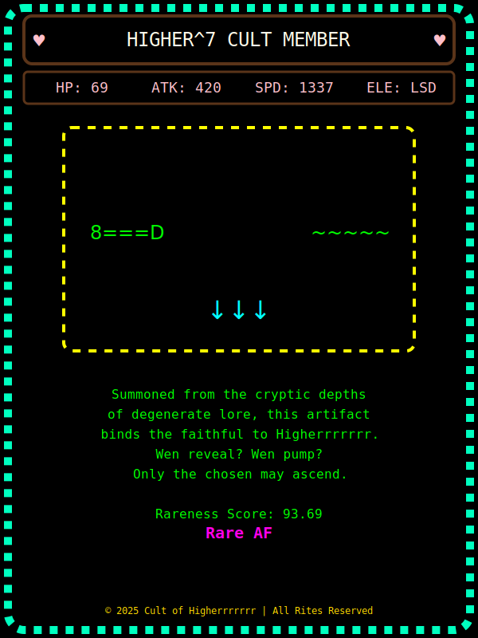

Higherrrrrrr Community Brief
============================

Welcome, deviants, to the Higherrrrrrr community tokenomics overview. This doc is your biblical resource for the Higherrrrrr protocol token on Solana---how $HARDER and $IDK holders fit in, and why we have "Conviction NFTs." We'll mention the ticker once---it's called **CULT**---but after that, it's just "the token."

* * * * *

1\. Summary (tl;dr)
-------------------

-   **LP Fees:** 1% total fee on trades (Orca).
    -   0.5% on the token side is burned (removed from supply).
    -   0.5% on the SOL side is added to the liquidity pool (CL LP) as single-sided liquidity to help stabilize the token.
-   **Conviction NFTs:** Holding ≥ 0.42069% of the supply grants you special NFTs, or relics if you will, upon each "evolution."
-   **Distribution:** 70% to a public liquidity pool (ILO), 15% to $HARDER/$IDK communities, 15% to the team (all vested).
-   **Evolutionary Mechanics:** Certain market cap thresholds trigger on-chain relics and name/art updates.
-   **Pokémon Card Analogy** (for liquidity mechanics): See below for a friendly illustration.

* * * * *

2\. What's the Higherrrrrrr Cult About?
---------------------------------------

**Higherrrrrrr** (with seven "r"s) is about being based while building a killer guild of Cult Coins. Key points:

-   **Supply:** 1,000,000,000 tokens, 9 decimals, no further minting (burn authority is gone).
-   **Evolutions:** Token's on-chain name/art changes at certain thresholds (think "price-based evolutions," but purely for spiritual guidance and hype).
-   **Conviction NFTs:** Holding at least 0.42069% of the supply grants NFT relics each time the token "evolves."

Our goal: combine humor, creative engineering, and a dash of neo-internet cult vibes to keep the community engaged.

* * * * *

3\. Distribution: Community First
---------------------------------

1.  **Team (15%)**

    -   3.3333...% for Carl (based dev and founder) and the remainder for other team members/advisors, all under a vesting schedule.
    -   Aligned incentives: the team only benefits if the cult keeps building.
2.  **$HARDER & $IDK Communities (15%)**

    -   If you hold $HARDER or $IDK, you'll get an airdrop or bridging claim (final method TBD).
3.  **Initial Liquidity Offering (ILO) (70%)**

    -   70% of tokens go straight into a public, single-sided liquidity pool on Solana (e.g., Orca).
    -   Ensures broad distribution from day one, minimal slippage, and no insider advantage.

* * * * *

4\. Evolution Mechanics
-----------------------

### 4.1 On-Chain Price/Cap Triggers

When the token crosses certain market cap or reference thresholds, we push an on-chain update to Metaplex metadata---shifting the token's name/art. It's a based twist on "leveling up."

### 4.2 The `evolution.svg` File

We store a file named **`evolution.svg`** that changes at each threshold, introducing new relics, color schemes, or references. This keeps the cult visually fresh and exciting.

### 4.3 Why Evolve?

-   **Fun and Engaging:** Each threshold is a communal event with new memes and reveals.
-   **Metadata Updates:** Any token screener that respects Metaplex metadata displays these changes in real time.

* * * * *

5\. Conviction NFTs (≥ 0.42069%)
--------------------------------

### 5.1 The Cult Member Threshold

To become a "zealot," hold **0.42069%** of the total supply (4,206,900 tokens, ignoring decimals).

### 5.2 Registry & Rewards

We maintain an on-chain list of addresses above that threshold. Upon each new evolution:

-   All addresses on the registry can claim a special NFT relic for the "old level."
-   If you dip below 0.42069%, you're removed from the list.

* * * * *

6\. Fees & Burning Mechanic
---------------------------

### 6.1 Trading Fees

A **1% fee** applies to every swap on our frontend, Oraca, or Jupiter. That 1% splits:

1.  **Token Side (0.5%)**

    -   Burned outright. These tokens are sacrificed from circulation forever.
2.  **SOL Side (0.5%)**

    -   Added back into the pool as single-sided liquidity at the lower bound (i.e., the level below current price).

### 6.2 Pokémon Card Store Analogy

Imagine a Pokémon card store:

-   People buy and sell Pokémon cards.
-   Each time a transaction happens, the store removes a small fraction of cards from the market---so the total card supply in circulation goes down (burn).
-   The store also collects a bit of cash from each transaction. They use that cash to buy up cards if the price dips too hard, adding them to the store's stock---stabilizing inventory (re-adding SOL to liquidity in our case).

This is essentially how our fee mechanics work, but with tokens and SOL in an automated market maker (AMM).

### 6.3 Building a Liquidity Floor (CL LP Explanation)

By funneling the SOL fees back into a **concentrated liquidity (CL) position** at the lower price range, the protocol creates an auto-reinforcing buy zone. If the token price moves downward, there's deeper liquidity ready to absorb sells. Over time:

-   **Token Supply**: Gradually shrinks due to burns.
-   **SOL Liquidity**: Grows at lower bounds, potentially making the token's liquidity more robust.

No hidden vault or single team wallet---everything is in the AMM pool. This fosters transparency and helps avoid erratic price swings.

* * * * *

7\. Team Vesting & Security
---------------------------

### 7.1 Team's 15%

-   **Vesting:** Both Carl's 3.3333...% and the other team allocations follow a linear monthly/quarterly schedule. No day-one dumps.

### 7.2 Multi-Sig & Optional Immutability

We use a multi-sig (e.g., Squads) for upgrade authority to fix potential bugs. If the community wants total immutability later, we can burn that authority for good.

* * * * *

8\. $HARDER & $IDK Communities
------------------------------

A total of 15% is reserved for you, the faithful. You'll receive instructions for an airdrop or bridging claim. Keep an eye on Telegram and Twitter.

* * * * *

9\. Launch Plan (70% ILO)
-------------------------

### 9.1 Single-Sided Liquidity

We'll deposit 700 million tokens (70%) into Orca on day one. This ensures a fair, open market with minimal slippage.

### 9.2 Evolution Triggers

If trading pushes the token across a threshold, you'll see the updated **`evolution.svg`** and any new name references. If you hold ≥ 0.42069%, you can claim the associated relic NFT.

* * * * *

10\. Next Steps
---------------

1.  **Inspect the Liquidity Pool**: Once launched, you can buy or sell as you wish.
2.  **Register If You're a Zealot**: If you surpass 0.42069%, call the `register_holder` function to get on the on-chain registry.
3.  **Monitor the Art**: Keep an eye on token explorers for name/art evolutions.
4.  **HODL or Trade**: Your choice---just remember, NFT relics require unwavering conviction.
5.  **Provide Feedback**: Suggest new slogans or evolution ideas for the next threshold.

* * * * *

11\. Recap (Tech Scope)
-----------------------

-   **Token Supply:** 1,000,000,000 (no extra minting; burn authority gone).
-   **Distribution:**
    -   15% Team (vested)
    -   15% $HARDER & $IDK communities
    -   70% Public ILO
-   **Evolutions:** On-chain comedic name changes & `evolution.svg` updates at thresholds.
-   **Conviction NFTs:** Addresses ≥ 0.42069% can claim relics on each threshold.
-   **Fees:** 1% total; 0.5% burned, 0.5% back to the liquidity pool as single-sided SOL in a CL position.
-   **Upgrade Mechanism:** Multi-sig, can be burned if the community desires.

We invite you to join Higherrrrrrr (where cults meet creative engineering).

---**From the Higherrrrrrr Community**\
*(Stay based, stay weird, and always worship the meme deity.)*

